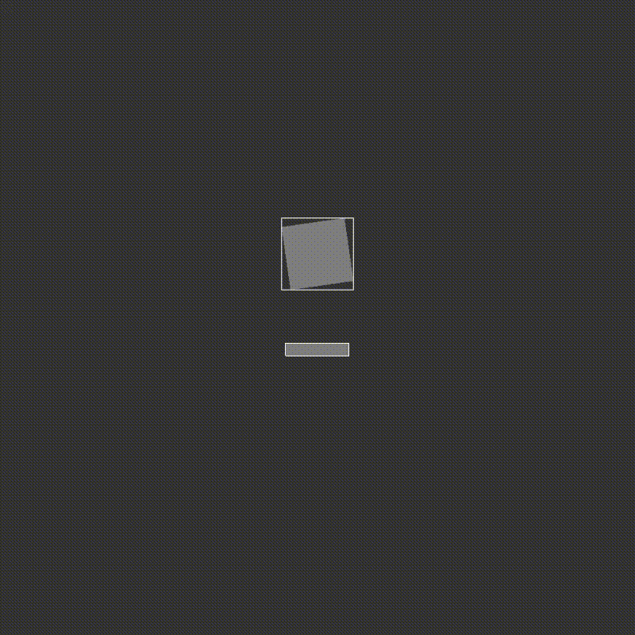

# OpenGL Framework – WIP Engine by Alan Kudełko

Welcome to my OpenGL framework – a modular, component-based foundation for building real-time 2D/3D applications in C++ using OpenGL. This project serves as both a learning journey and a functional base for developing larger projects, including games such as an Arkanoid-style clone.

> 🔧 Status: In development  
> 🎮 Goal: Build a lightweight OpenGL engine with clean architecture, modular components, and expandable systems for rendering, physics, and scripting.

---

## 🧱 Project Structure

All custom engine code resides in the `GLS` folder and is built around a component-based architecture, enabling maximum flexibility and reuse across subsystems.

### 📦 Core Classes

| Class | Description |
|-------|-------------|
| `GL_VertexData` | Defines vertex attributes (position, color, UVs). Easily extensible with normals or tangents. |
| `GL_Shape`, `GL_Triangle`, `GL_Polygon` | Base and derived classes for drawing geometric primitives. Manages VAO/VBO/EBO and rendering data. |
| `GL_Shader` | Manages GLSL shader loading, compilation, linking, and error logging. |
| `GL_Component` | Abstract base class for all attachable object components (e.g., shaders, shapes, colliders). Enables flexible scene composition. |
| `GL_Transform` | Encapsulates local object transformation: position, rotation, scale. |
| `GL_GameObject` | Represents a single entity in the scene. Holds references to attached components. |
| `GL_SceneRenderer` | Responsible for rendering scene objects using OpenGL. Supports debug rendering of colliders. |
| `GL_SceneManager` | Stores and manages active `GL_GameObject` instances. Provides scene update and access routines. |
| `GL_Collider` + derivatives | Defines collision shapes (box, mesh, sphere) and handles AABB/SAT detection support. |
| `GL_CollisionManager` | Coordinates broad-phase and narrow-phase collision checks. To be expanded with manifold resolution. |
| `GL_PhysicsBody`, `GL_PhysicsManager` | Implements basic physics integration (WIP). Handles motion, forces, and future collision response. |
| `GL_ResourceManager` | Centralized access to geometry and shader assets. Prevents duplication and manages caching. |

---

## 🧠 Design Goals

- 🧩 Modular components with extensibility in mind  
- 🧮 Real-time rendering via OpenGL 3+  
- 🚦 Two-phase collision detection (AABB + SAT)  
- 💥 Planned scripting via dynamically loaded libraries (DLLs)  
- 🔁 Efficient scene update & rendering cycles  
- 🔍 Clear separation of logic: geometry, physics, rendering, input  

---

## 🗺️ Roadmap

- [x] Base rendering system with `GL_Shape` and `GL_Shader`
- [x] Scene manager with object lifecycle control
- [x] Collision detection: AABB + SAT
- [ ] Collision response: contact point, normal, penetration
- [ ] Physics integration and object resolution
- [ ] Input system for interactive gameplay
- [ ] Scriptable logic via DLLs (`GL_Script`)
- [ ] Arkanoid-style demo game
- [ ] GUI-based scene editor (stretch goal)

---

## 🧪 How to Run

> 🔧 Requires:
- C++17+
- OpenGL 3.3+
- GLM
- GLFW
- GLAD

The project is ready to run immediately after cloning.

---

## 📁 Folder Structure
/GLS  
├── GL_Component.h  
├── GL_Shape.h / .cpp  
├── GL_Shader.h / .cpp  
├── GL_Collider.h / .cpp  
├── GL_GameObject.h / .cpp  
├── GL_SceneManager.h / .cpp  
├── GL_SceneRenderer.h / .cpp  
├── GL_CollisionManager.h / .cpp  
├── GL_PhysicsBody.h / .cpp  
└── ...  

## Collisions demo

